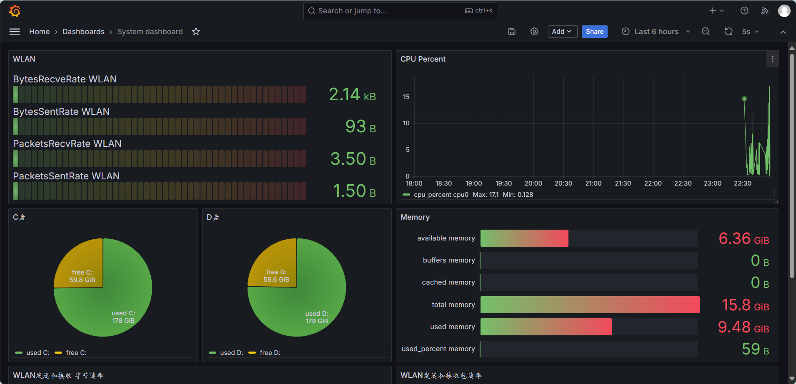
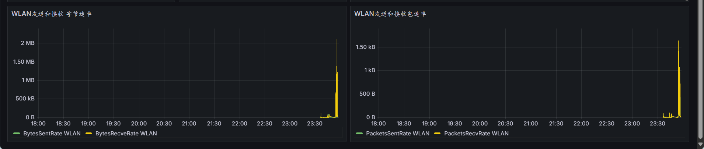

# 日志收集

收集繁杂的日志，提供更友好的查询方式，提高工作效率。

## grafana数据监控

## 功能模块

- [x] 读取yaml文件获取系统配置。
- [x] 使用etcd存储topic和日志路径。
- [x] 开启goroutine，根据etcd中的值动态更新读取日志文件的任务
- [x] 使用tail获取指定日志文件中的数据。
- [x] 将数据发送到Kafka中。
- [x] 收集系统信息，发送到Influxdb中。
- [x] 使用grafana展示系统信息。
